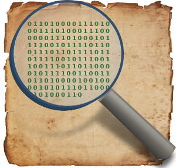
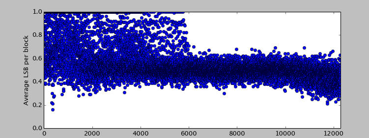
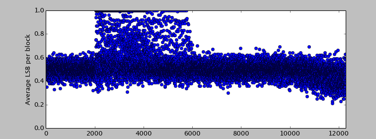

cloacked-pixel-python3
==========

Platform independent Python tool to implement LSB image steganography and a basic detection technique. Features:

 - Encrypt data before insertion.
 - Embed within LSBs.
 - Extract hidden data.
 - Basic analysis of images to detect LSB steganography.

How to use:

    $ python lsb.py 
    LSB steganogprahy. Hide files within least significant bits of images.
    
    Usage:
      lsb.py hide <img_file> <payload_file> <password>
      lsb.py extract <stego_file> <password>
      lsb.py analyse <stego_file>


Hide
----

All data is encrypted before being embedded into a picture. Encryption is not optional. Two consequences of this are that:

 - The payload will be slightly larger.
 - The encrypted payload will have a high entropy and will be similar to random data. This is why the frequency of 0s and 1s in the LSB position should be the same – 0.5. In many cases, real images don’t have this propriety and we’ll be able to distinguish unaltered images from the ones with embedded data. More below.

Encrypt and hide an archive:

    $ python .\lsb.py hide .\demo\test.png .\demo\flag.txt '123456'
    [*] Input image size: 2433x1080 pixels.
    [*] Usable payload size: 962.27 KB.
    [+] Payload size: 0.043 KB
    [+] Encrypted payload size: 0.082 KB
    [+] C:\Users\97766\Downloads\WSL\cloacked-pixel-python3\demo\flag.txt embedded successfully!


Original image:


Image with 44 bytes embedded:


Extract
-------

    $ python .\lsb.py extract .\demo\test-stego.png '123456'
    [+] Image size: 2433x1080 pixels, Payload size(AES): 0.08 KB, key: 123456
    [+] Written extracted data to C:\Users\97766\Downloads\WSL\cloacked-pixel-python3\demo\test-stego.png.out.
    
    $ cat .\demo\test-stego.png.out
    BYXS20{a246f2c4-3114-4dc4-b8a6-e7fb37334fa5}

## 优化

1. 遇到没有隐写的图片会提示：

```
$ python .\lsb.py extract .\demo\test.png '123456'
[-] 图像负载的AES信息大小不为32的倍数, 所以不存在该隐写!
```

2. 遇到密码错误的情况会提示：

```
$ python .\lsb.py extract .\demo\test-stego.png '1'
[+] Image size: 2433x1080 pixels, Payload size(AES): 0.08 KB, key: 1
[-] 字节大小不正确, 所以密码不正确!
```

Detection
---------

A simple way to detect tampering with least significant bits of images is based on the observation above – regions within tampered images will have the average of LSBs around 0.5, because the LSBs contain encrypted data, which is similar in structure with random data. So in order to analyse an image, we split it into blocks, and for each block calculate the average of LSBs. To analyse a file, we use the following syntax:

    $ python lsb.py analyse <stego_file>

**Example**


Now let’s analyse the original:

    $ python lsb.py analyse castle.jpg



… and now the one containing  our payload:

    $ python lsb.py analyse castle.jpg-stego.png




Notes
-----

 - It is entirely possible to have images with the mean of LSBs already very close to 0.5. In this case, this method will produce false positives.
 - More elaborate theoretical methods also exist, mostly based on statistics. However, false positives and false negatives cannot be completely eliminated.

